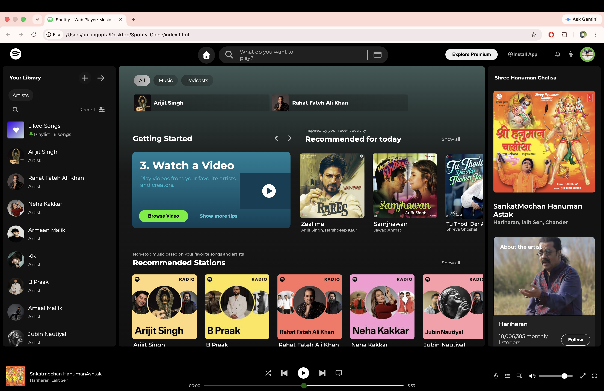

# 🎵 Spotify Clone

My first web development project — a Spotify-inspired web player interface built using HTML and CSS.

## 📌 About the Project

This is my first front-end web development project. I created this Spotify-inspired web player to practice and improve my HTML and CSS skills.

The project recreates a Spotify-style music interface with a navigation bar, library sidebar, music cards, artist sections, recommended stations, recent items, and a bottom music player.

## ✨ Features

- 🎵 Spotify-inspired dark UI
- 🧭 Top navigation bar
- 🔍 Search bar UI
- 📚 Your Library sidebar
- 🎶 Liked Songs section
- 🎤 Artist list
- 🎧 Music and playlist cards
- 🖱️ Hover effects and tooltips
- 📜 Custom scrollbars
- ▶️ Play button UI
- 📊 Music progress bar
- 🔊 Volume controls
- 👤 Profile section
- 🎵 Bottom music player
- 🎨 Custom layouts and styling

## 🛠️ Technologies Used

- HTML5
- CSS3
- Font Awesome
- Google Fonts (Montserrat)

## 📂 Project Structure

```text
Spotify-Clone/
│
├── index.html
├── style.css
├── screenshot.png
├── README.md
│
└── images/
    ├── Arijit.jpeg
    ├── rahat.jpeg
    ├── Neha.jpeg
    ├── jubin.jpeg
    ├── armaan.jpeg
    ├── KK.jpeg
    ├── praak.jpeg
    ├── amaal.jpeg
    ├── darshan.jpeg
    └── ...


## 📸 Project Preview




## 🎯 Project Goal

The goal of this project was to practice HTML and CSS by building a complete music streaming interface inspired by Spotify.

## 📚 What I Learned

While building this project, I practiced:

- HTML page structure
- CSS Flexbox
- CSS positioning
- Creating layouts
- Creating scrollable sidebars
- Customizing scrollbars
- Hover effects
- CSS transitions
- Tooltips
- Working with images and assets
- Organizing project files
- Building a complete web page UI

## 📌 Project Status

🟢 **Completed — HTML & CSS Version**

The current version focuses on the front-end UI and visual design.

## 🚀 Future Improvements

- Add JavaScript functionality
- Add play/pause functionality
- Add real music playback
- Add working search functionality
- Add playlist functionality
- Improve responsiveness for different screen sizes
- Add interactive music controls

## 🌐 Live Demo

[🚀 View Live Demo](https://amankgupta-dev.github.io/spotify-clone/)

## 👨‍💻 Author

**Aman Kumar Gupta**

This is my first web development project, built as part of my journey to learn front-end development.

## ⚠️ Disclaimer

This is a practice/educational project inspired by the Spotify web player interface. It is not an official Spotify product and is not affiliated with Spotify.
